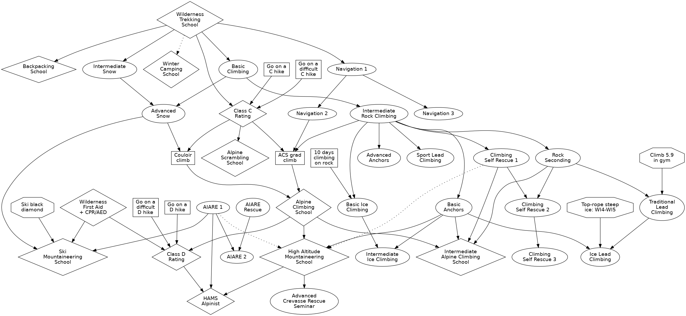

# Colorado Mountain Club Course Curriculum

The [Colorado Mountain Club][] offers a ton of terrific and inexpensive
[classes][] to teach its members everything from backcountry navigation to
crevasse rescue to ski mountaineering! It's a great organization.

[Colorado Mountain Club]: https://www.cmc.org/
[classes]: https://www.cmc.org/Classes/CMCClassesandSchools.aspx

The downside to having so many choices, though, is that it can be hard to figure
out which classes depend on each other. That's (pretty much) all documented on
the Web site, of course, but I prefer a visual layout, so here we are.

This chart is available in the following formats:

- [PDF](cmc-curriculum.pdf)
- [PNG](cmc-curriculum.png)
- [SVG](cmc-curriculum.svg)

I hope it's more helpful than it is overwhelming!

- Ovals are individual classes,
- Diamonds are schools, certifications, or hiker ratings,
- Rectangles are events, and
- Octogons are degrees of skill.

Dotted lines are suggested, but not strictly required.

### Disclaimers

I'm a member of the CMC, and I've taken a bunch of these classes, but I neither
teach anything nor hold a leadership position. This is not official!

Dependencies change, sometimes frequently, and classes come and go. Course
prerequisites are more about safety and skills than about rules-for-rules-sake,
so take all this with a grain of salt. For the final word, consult the CMC.

This focuses on the Denver group, since that's by far the biggest chapter (and
the only one I'm involved with). Other CMC chapters do things differently.

This chart omits a few classes that both have no dependencies and that nothing
depends on, like [Wilderness Survival School][], [Backcountry Ski Touring][],
and [Fly Fishing][]. Conversely, it also includes some things that aren't listed
on the official Web site but that *do* seem to be regularly offered, like the
[Advanced Crevasse Rescue Seminar][] and [AIARE 2][].

[Wilderness Survival School]: https://www.cmc.org/Classes/CMCClassesandSchools/WildernessSurvivalSchool.aspx
[Backcountry Ski Touring]: https://www.cmc.org/Classes/CMCClassesandSchools/BackcountrySkiTouring.aspx
[Fly Fishing]: https://www.cmc.org/Classes/CMCClassesandSchools/FlyFishingSchool.aspx
[Advanced Crevasse Rescue Seminar]: https://www.cmc.org/Calendar/EventDetails.aspx?ID=46840
[AIARE 2]: https://www.cmc.org/Calendar/EventDetails.aspx?ID=44725

### Editing

This chart's written in [graphviz][] and managed with `make`. Install those
tools, `cd` into the directory, and run:

    $ make

Happy hacking!

[graphviz]: https://graphviz.org/
